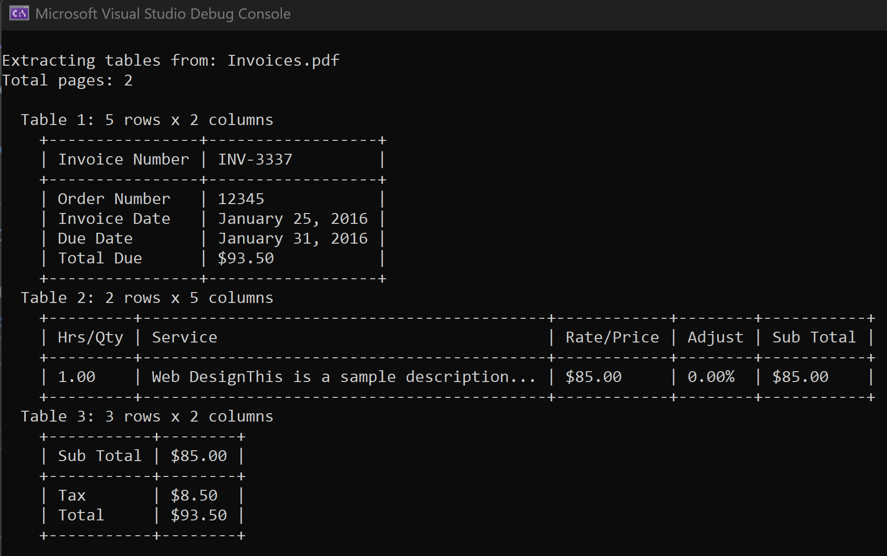

# Extract Tables from PDF Documents with C# - GroupDocs.Parser Examples

[](https://products.groupdocs.com/parser/net/) 
[](https://docs.groupdocs.com/parser/net/) 
[](https://products.groupdocs.app/parser/total) 
[](https://reference.groupdocs.com/parser/net/) 
[](https://blog.groupdocs.com/category/parser/) 
[](https://forum.groupdocs.com/c/parser) 
[](https://purchase.groupdocs.com/temp-license/100308)

## 📋 Quick Navigation

- [Overview](#-overview)
- [Business Needs Challenge](#-business-needs-challenge)
- [Features](#-features)
- [Getting Started](#-getting-started)
- [Code Examples](#-code-examples)
- [Use Cases](#-use-cases)
- [Supported Formats](#-supported-formats)
- [Resources](#-resources)

---

## 📖 Overview

This repository demonstrates how to **extract tables from PDF documents** using [GroupDocs.Parser for .NET](https://products.groupdocs.com/parser/net/). Learn how to **parse document tables**, **extract table values**, and process structured data from PDF files programmatically with C#.

**Key Capabilities:**
- ✅ **Extract tables** from PDF documents automatically
- ✅ **Parse document** structures without templates
- ✅ **Extract table values** with cell-level precision
- ✅ Process tables from specific pages or entire documents
- ✅ Display extracted tables in formatted console output

> **Note:** This repository currently focuses on **table extraction without templates**. Template-based extraction examples will be added in future updates.

---
## 💼 Business Needs Challenge

Modern businesses face the critical challenge of efficiently **extracting document data** from PDF files containing structured tables. Manual data entry is time-consuming, error-prone, and doesn't scale. Organizations need automated solutions to **parse document** structures and **extract tables** programmatically to access critical business information.

### Common Document Processing Requirements

**1. Invoice and Financial Document Processing**

Businesses receive hundreds of invoices, receipts, and financial statements daily. Each document contains critical **table extraction** needs:
- **Extract document data** from invoice line items (product names, quantities, prices)
- **Parse document** tables to capture billing addresses, tax calculations, and totals
- **Extract tables** containing payment terms, discounts, and shipping information
- Automatically process vendor invoices for accounts payable automation

**Solution:** Automatic **table extraction** eliminates manual data entry, reduces processing time from hours to seconds, and ensures 100% accuracy when **extracting tables** from financial documents. With programmatic **table extraction**, businesses can process thousands of invoices daily, extract all relevant data, and integrate directly into accounting systems.

**2. Report and Analytics Data Extraction**

Organizations generate and receive numerous reports containing analytical data in tabular format:
- **Extract document data** from sales reports with product performance metrics
- **Parse document** tables containing quarterly financial results and KPIs
- **Extract tables** from operational reports with inventory levels, production metrics, and resource utilization
- Process regulatory compliance reports with structured data requirements

**Solution:** Automated **table extraction** enables businesses to **extract tables** from reports programmatically, transforming static PDF documents into actionable data. This allows for real-time data analysis, automated reporting pipelines, and seamless integration with business intelligence tools. By **extracting document data** automatically, organizations can make data-driven decisions faster and maintain accurate records.

**3. Purchase Orders and Supply Chain Documents**

Supply chain operations depend on accurate data extraction from purchase orders, shipping manifests, and inventory reports:
- **Extract document data** from purchase orders including SKU numbers, quantities, and unit prices
- **Parse document** tables to capture supplier information, delivery dates, and shipping addresses
- **Extract tables** containing inventory levels, stock movements, and warehouse locations
- Process shipping manifests with item lists, tracking numbers, and delivery confirmations

**Solution:** **Table extraction** automates the entire supply chain document processing workflow. By **extracting tables** from purchase orders and shipping documents, businesses can automatically update inventory systems, track shipments, and reconcile orders without manual intervention. This **table extraction** capability ensures supply chain visibility and reduces processing errors.

### Why Automatic Table Extraction Matters

Traditional manual data extraction is inefficient and costly. **Table extraction** technology solves these challenges by:

- **Eliminating Manual Errors:** Automated **table extraction** ensures consistent, accurate data capture
- **Scaling Operations:** **Extract tables** from hundreds of documents in minutes, not days
- **Reducing Costs:** Cut data entry costs by up to 90% with automated **table extraction**
- **Improving Speed:** **Parse document** files instantly and **extract document data** in real-time
- **Enabling Integration:** **Extract tables** directly into databases, ERP systems, and analytics platforms

Whether you need to **extract document data** from invoices, **parse document** reports, or **extract tables** from any PDF document, automated **table extraction** provides the solution to transform unstructured documents into structured, actionable data.

---

## ✨ Features

### Table Extraction Capabilities

- **Automatic Table Detection** – No templates required for basic table extraction
- **Page-Specific Extraction** – Extract tables from specific pages
- **Full Document Processing** – Extract all tables across all pages
- **Structured Output** – Formatted table display with headers and values
- **Cell-Level Access** – Access individual table cells and their content

### What You Can Extract

- Table headers and data rows
- Cell values with precise positioning
- Table dimensions (rows × columns)
- Multi-page table extraction
- Tables organized by page

---

## 🚀 Getting Started

### Prerequisites

- **.NET 6.0** or later (.NET 9.0 recommended)
- **GroupDocs.Parser for .NET** NuGet package
- Valid **GroupDocs.Parser license** (optional for evaluation)

### Installation

**Clone the repository:**
   ```bash
   git clone https://github.com/groupdocs-parser/Pdf-tables-extraction-using-groupdocs-parser.git
   cd Pdf-tables-extraction-using-groupdocs-parser
   ```

### License Setup (optional)

For production use, set your GroupDocs.Parser license:

```csharp
new License().SetLicense(@"path\to\GroupDocs.Parser.NET.lic");
```

For evaluation, you can use a [temporary license](https://purchase.groupdocs.com/temp-license/100308).

---

## 💻 Code Examples

### Example 1: Extract Tables from a Specific Page

This example demonstrates how to **extract tables from a particular page** of a PDF document. The method analyzes the document structure and extracts all tables found on the specified page.

**Source Document:**


**Code:**

```csharp
static void ExtractTablesPerParticluarPage()
{
    string sample = "Invoices.pdf";
    
    // Initialize parser with PDF document
    using (var parser = new Parser(sample))
    {
        // Get document information
        var documentInfo = parser.GetDocumentInfo();
        int pageCount = documentInfo.PageCount;
        
        // Extract tables from first page (pageIndex = 0)
        var pageIndex = 0;
        var tables = parser.GetTables(pageIndex);

        if (tables != null && tables.Any())
        {
            int tableNumber = 1;
            foreach (var table in tables)
            {
                // Process each table
                // Display table dimensions and content
                ProcessTable(table);
                tableNumber++;
            }
        }
    }
}
```

**Console Output:**


### Example 2: Extract All Tables from Document

Extract all tables from all pages of a PDF document, organized by page:

```csharp
static void ExtractAllTablesFromDocument()
{
    string sample = "TablesReport.pdf";

    using (var parser = new Parser(sample))
    {   
        // Get all tables from entire document
        var tables = parser.GetTables();

        if (tables != null && tables.Any())
        {
            // Group tables by page index
            var tablesByPage = tables
                .GroupBy(table => table.Page.Index)
                .OrderBy(group => group.Key);

            foreach (var pageGroup in tablesByPage)
            {
                int pageIndex = pageGroup.Key;
                Console.WriteLine($"Tables in the Page {pageIndex + 1}");
                
                int tableNumber = 1;
                foreach (var table in pageGroup)
                {
                    Console.WriteLine($"  Table {tableNumber}: {table.RowCount} rows x {table.ColumnCount} columns");
                    ProcessTable(table);
                    tableNumber++;
                }
            }
        }
    }
}
```

### Example 3: Access Individual Table Cells

Access and process individual cells from extracted tables:

```csharp
static void ProcessTable(PageTableArea table)
{
    // Calculate column widths for proper alignment
    int[] columnWidths = Enumerable.Range(0, table.ColumnCount)
        .Select(col => Math.Max(3, Enumerable.Range(0, table.RowCount)
            .Max(row => table[row, col]?.Text?.Length ?? 0)))
        .ToArray();

    // Display table with borders
    string separator = "+" + string.Join("+", columnWidths.Select(w => new string('-', w + 2))) + "+";
    
    // Display header row (first row)
    Console.WriteLine("    " + separator);
    Console.Write("    |");
    for (int col = 0; col < table.ColumnCount; col++)
    {
        string cellText = GetCellText(table, 0, col);
        Console.Write($" {cellText.PadRight(columnWidths[col])} |");
    }
    Console.WriteLine();
    Console.WriteLine("    " + separator);

    // Display data rows
    for (int row = 1; row < table.RowCount; row++)
    {
        Console.Write("    |");
        for (int col = 0; col < table.ColumnCount; col++)
        {
            string cellText = GetCellText(table, row, col);
            Console.Write($" {cellText.PadRight(columnWidths[col])} |");
        }
        Console.WriteLine();
    }
    Console.WriteLine("    " + separator);
}

static string GetCellText(PageTableArea table, int row, int col)
{
    return table[row, col]?.Text ?? "";
}
```

---

## 🎯 Use Cases

### Business Document Processing

- **Invoice Processing** – Extract line items, totals, and payment information
- **Financial Reports** – Parse balance sheets, income statements, and financial tables
- **Purchase Orders** – Extract product details, quantities, and pricing
- **Receipts** – Extract itemized lists and transaction details

### Data Migration & Integration

- **Database Import** – Convert PDF tables to database records
- **Excel Conversion** – Extract tables for spreadsheet processing
- **API Integration** – Parse document tables for REST API consumption
- **ETL Pipelines** – Extract, transform, and load table data

### Document Analysis

- **Report Analysis** – Extract structured data from business reports
- **Compliance Documents** – Parse regulatory tables and forms
- **Research Data** – Extract tables from research papers and publications
- **Legal Documents** – Parse tables from contracts and legal filings

### Automation & Workflows

- **Automated Data Entry** – Reduce manual data entry from PDFs
- **Batch Processing** – Process multiple PDF documents automatically
- **Content Indexing** – Extract tables for search engine indexing
- **Data Validation** – Verify table data against business rules

---

## 📄 Supported Formats

### Document Formats

| Format | Extension | Table Extraction |
|--------|-----------|-----------------|
| **PDF** | `.pdf` | ✅ Supported |
| **Microsoft Word** | `.doc`, `.docx` | ✅ Supported |
| **Microsoft Excel** | `.xls`, `.xlsx` | ✅ Supported |
| **Microsoft PowerPoint** | `.ppt`, `.pptx` | ✅ Supported |
| **OpenDocument** | `.odt`, `.ods`, `.odp` | ✅ Supported |

> **Note:** This repository focuses on PDF table extraction. Other formats are supported by GroupDocs.Parser but not demonstrated in these examples.

---

## 🔧 Project Structure

```
Pdf-tables-extraction-using-groupdocs-parser/
│
├── Program.cs                 # Main code examples
├── README.md                  # This file
├── LICENSE                    # License file
│
├── Invoices.pdf              # Sample PDF document
├── TablesReport.pdf          # Sample PDF with tables
├── Operations.pdf            # Sample PDF document
│
├── document-page-01.png      # Document preview image
├── console-output-01.png     # Console output example
│
└── bin/                      # Build output directory
```

---

## 📚 Resources

### Documentation & Learning

- 📖 [GroupDocs.Parser for .NET Documentation](https://docs.groupdocs.com/parser/net/)
- 📚 [API Reference](https://reference.groupdocs.com/parser/net/)
- 🎓 [Working with Tables Guide](https://docs.groupdocs.com/parser/net/working-with-tables/)
- 💡 [Code Samples](https://github.com/groupdocs-parser/GroupDocs.Parser-for-.NET)

### Support & Community

- 💬 [Free Support Forum](https://forum.groupdocs.com/c/parser/)
- 🆘 [Paid Support Helpdesk](https://helpdesk.groupdocs.com/)
- 📝 [Blog Articles](https://blog.groupdocs.com/category/parser/)
- 🎬 [Video Tutorials](https://www.youtube.com/c/groupdocs)

### Product Information

- 🌐 [Product Page](https://products.groupdocs.com/parser/net/)
- 🎮 [Live Demos](https://products.groupdocs.app/parser/total)
- 🔑 [Get Temporary License](https://purchase.groupdocs.com/temp-license/100308)
- 💰 [Pricing Information](https://purchase.groupdocs.com/pricing/parser/net)

---

## 🤝 Contributing

Contributions are welcome! If you'd like to contribute:

1. Fork the repository
2. Create a feature branch (`git checkout -b feature/amazing-feature`)
3. Commit your changes (`git commit -m 'Add amazing feature'`)
4. Push to the branch (`git push origin feature/amazing-feature`)
5. Open a Pull Request

### Contribution Ideas

- Add more table extraction examples
- Improve error handling
- Add template-based extraction examples
- Enhance documentation
- Add unit tests

---

## 🔮 Roadmap

### Current Features ✅
- Extract tables from PDF documents
- Page-specific table extraction
- Full document table extraction
- Formatted table display

### Coming Soon 🚀
- Template-based table extraction examples
- OCR support for scanned PDFs
- Batch processing multiple documents
- Export to CSV/Excel formats
- Advanced table formatting options

---

## 📊 Keywords & SEO

**Primary Keywords:**
- extract table from PDF
- parse document tables
- extracting table values
- PDF table extraction C#
- GroupDocs.Parser examples
- table parsing .NET
- extract tables from PDF documents
- parse PDF tables programmatically
- C# PDF table extraction
- document table parser

**Related Terms:**
- PDF parser, table extraction, document parsing, data extraction, PDF processing, C# PDF library, .NET PDF parser, table data extraction, structured data extraction, PDF table reader

---

## ⭐ Star History

If you find this repository helpful, please consider giving it a star! ⭐

---

**Made with ❤️ by [GroupDocs](https://www.groupdocs.com/)**
